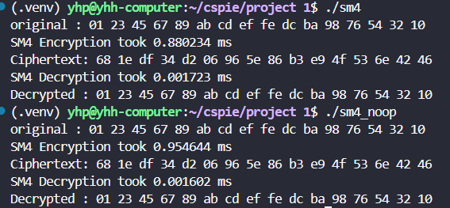
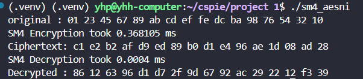
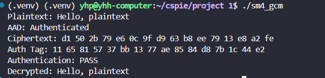

# SM4加速

本项目实现了 SM4 对称密码算法的查表优化版本，通过使用4个预计算查找表替代传统的 S盒和循环移位运算显著提升算法执行效率。同时也实现了AES-NI指令集优化,AES-NI指令集可以加速S盒查找操作，这是SM4算法的性能瓶颈。最后在查表优化的基础上实现了SM4-GCM 认证加密模式。

## 算法原理

传统SM4轮函数需要对每个字节进行S盒查找和多次循环移位、异或等线性变换，计算量较大。查表优化将传统SM4算法的S盒替换和线性变换合并为：able0-Table3: 每个表256个32位条目，直接输出变换后的结果，通过一次查表操作替代多次位运算，大幅减少计算开销。这样，原本复杂的多步运算被简化为几次高效的内存查找和异或操作，显著提升了SM4算法的执行效率。

AES-NI指令通过S盒加速和并行处理优化算法。具体来说，此实现利用了128位的SIMD寄存器和并行字节混洗指令。将S盒的256个条目拆分为两个16字节的查找表，并通过高效的向量化混洗操作，一次性对16个字节并行完成S盒查找。这种方法避免了传统的、逐字节的内存查找和分支预测开销，显著提升了轮函数的计算速度。

SM4-GCM 是 SM4 算法与 GCM 认证加密模式的结合，当使用 SM4-GCM 时，不仅加密了数据，还获得了一个“签名”，可以用来验证接收到的数据是否是未经修改的。这在需要高安全性的网络通信中非常重要。

## 文件说明

- `main.cpp`: 主程序，包含测试用例和性能测试
- `sm4.h`: SM4算法头文件，定义接口和计时器类
- `sm4_table.cpp`: SM4查找表优化实现
- `sm4_noop.cpp`: SM4无优化标准实现
- `sm4_aesni.cpp`: SM4 aesni优化实现
- `sm4_gcm.cpp`: SM4 gcm实现

## 使用方法
确认CPU支持AES-NI可以输入下面指令，若输出包含aes则支持。

` grep -m1 -o 'aes' /proc/cpuinfo`

编译table优化版本，在终端中输入命令：

` g++ main.cpp sm4_table.cpp  -o sm4 `

编译AESNI优化版本，在终端中输入命令：

` g++ -mssse3 sm4_aesni.cpp main.cpp -o sm4_aesni `

编译 SM4-GCM版本，在终端中输入命令：

`g++ sm4_gcm.cpp sm4_table.cpp  -o sm4_gcm`

编译无优化版本，在终端中输入命令：

` g++ main.cpp sm4_noop.cpp  -o sm4_noop `

## 运行结果
以下是SM4算法的执行结果，发现在同时执行1000次加密的时候，查表法比普通版本快，而aesni比前者都快，同时gcm验证也成功：

