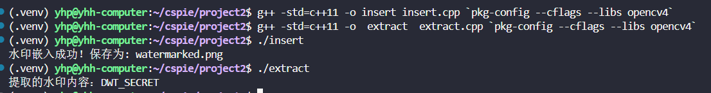

# 水印嵌入和提取
## 算法原理

本项目基于离散小波变换(DWT)实现数字水印的嵌入和提取。

### 1. DWT变换
- 使用Haar小波对图像进行2D-DWT分解。
- 将图像分解为4个子带：LL、LH、HL、HH。

### 2. 水印嵌入策略
- 将水印文本转换为二进制序列
- 在YUV颜色空间的Y分量上操作
- 修改LL子带中系数的奇偶性来嵌入水印位
- 使用可调节的强度参数α控制嵌入强度

### 3. 水印提取
- 对含水印图像进行相同的DWT分解
- 通过检测LL子带系数的奇偶性提取水印位
- 将二进制序列转换回文本

## 文件说明

- `insert.cpp`: 水印嵌入程序
- `extract.cpp`: 水印提取程序
- `project2.png`: 从网上下载的图像，将水印加在他上面
- `watermarked.png`: 嵌入水印后的图像

## 如何运行
opencv 库:

`sudo apt install libopencv-dev `

`sudo apt update`

编译代码:

```bash
g++ -std=c++11 -o  extract  extract.cpp `pkg-config --cflags --libs opencv4`

 g++ -std=c++11 -o insert insert.cpp `pkg-config --cflags --libs opencv4`
```
## 结果
结果可以看到，水印被成功的嵌入和提取，同时观察watermarked.png可以发现，嵌入水印后的图片没什么区别。
