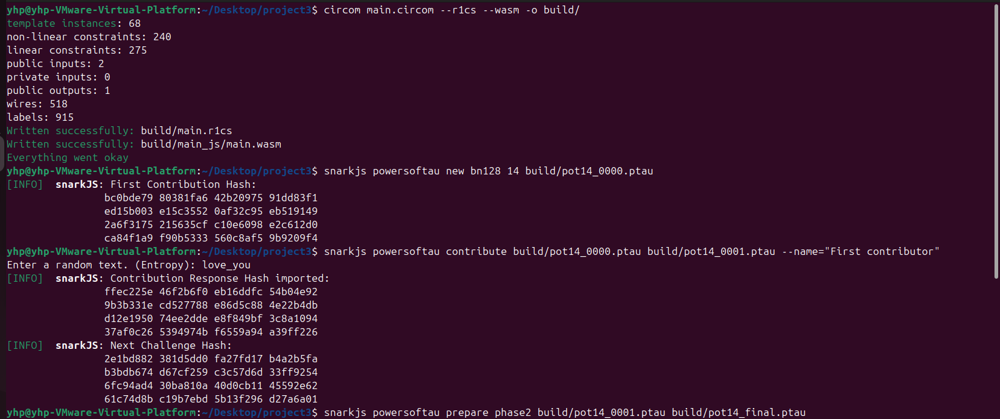
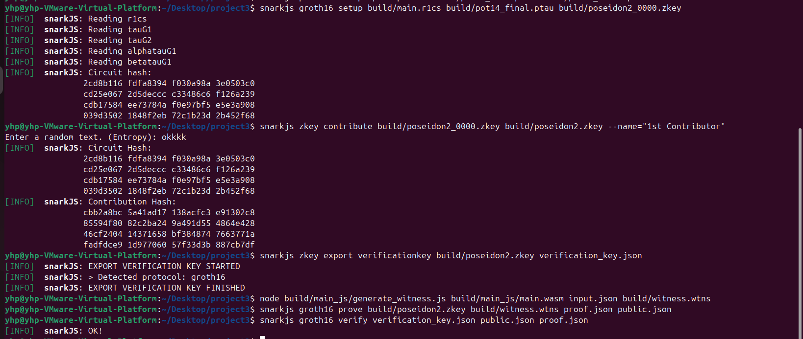

# circom实现poseidon2哈希算法的电路，并用groth16证明

## 项目简介
本项目使用Circom语言实现了Poseidon2哈希算法的零知识证明电路，并通过Groth16证明系统验证哈希计算的正确性。

Poseidon2是一个专为零知识证明系统优化的哈希函数，具有高效的电路实现特性。

Circom语言是一种专门用于编写零知识证明电路的DSL。主要用于描述和实现可在 zkSNARKs 等零知识证明系统中运行的算术电路。


## 项目结构
```
project3/
├── main.circom          # 主电路文件
├── circuit/
│   └── poseidon2.circom # Poseidon2哈希算法实现
├── input.json           # 输入数据文件

```

## 技术细节
- **电路参数**: (256,3,5) - 256位状态，3个元素的状态向量，5次幂的S-box
- **椭圆曲线**: BN128 (alt_bn128)
- **证明系统**: Groth16
- **输入**: 两个字段元素 [3, 4]
- **输出**: 单个哈希值

## 依赖库

### 安装 Rust
```bash
curl --proto '=https' --tlsv1.2 -sSf https://sh.rustup.rs | sh
source ~/.cargo/env
```

### 安装 Circom
```bash
sudo apt update
sudo apt install -y build-essential libgmp-dev nasm
git clone https://github.com/iden3/circom.git
cd circom
cargo build --release
sudo cp target/release/circom /usr/local/bin/
```

### 安装 SnarkJS
```bash
npm install -g snarkjs
```

### 验证安装
```bash
circom --version
snarkjs --version
node --version
```

### 输入格式
输入文件 `input.json` 包含两个整数作为哈希函数的输入：
```json
{
    "inputs": [3, 4]
}
```

## 完整运行流程

### 第一步：编译电路
```bash
# 创建build目录
mkdir -p build

# 编译circom电路为R1CS约束系统和WASM见证生成器
circom main.circom --r1cs --wasm -o build/
```

### 第二步：生成可信设置 (Powers of Tau)
```bash
# 生成初始的powers of tau文件 (2^14 = 16384 约束)
snarkjs powersoftau new bn128 14 build/pot14_0000.ptau

# 贡献随机性
snarkjs powersoftau contribute build/pot14_0000.ptau build/pot14_0001.ptau --name="First contributor"

# 准备第二阶段
snarkjs powersoftau prepare phase2 build/pot14_0001.ptau build/pot14_final.ptau
```

### 第三步：生成proving key和verification key
```bash
# 运行Groth16设置生成proving key
snarkjs groth16 setup build/main.r1cs build/pot14_final.ptau build/poseidon2_0000.zkey

# 贡献随机性到key
snarkjs zkey contribute build/poseidon2_0000.zkey build/poseidon2.zkey --name="1st Contributor"

# 导出verification key
snarkjs zkey export verificationkey build/poseidon2.zkey verification_key.json
```

### 第四步：生成证明并验证
```bash
# 生成见证 (witness)
node build/main_js/generate_witness.js build/main_js/main.wasm input.json build/witness.wtns

# 生成Groth16证明
snarkjs groth16 prove build/poseidon2.zkey build/witness.wtns proof.json public.json

# 验证证明
snarkjs groth16 verify verification_key.json public.json proof.json
```

## 运行结果
下面是成功运行的结果截图，最后输出"OK"说明零知识证明验证成功：



