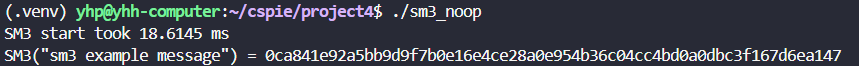
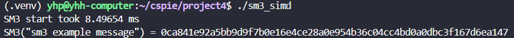

# SM3的实现和加速

本项目实现了国密SM3散列算法的标准版本和SIMD优化版本，通过使用SIMD指令集来加速SM3算法的执行。

## 项目概述

SM3是中华人民共和国国家密码管理局制定的密码散列函数标准，产生256位散列值。该算法采用Merkle-Damgård结构，具有优良的安全性和计算效率。

## SM3算法原理

SM3散列算法的主要计算步骤包括：

1. **消息填充**：将输入消息按512位分组，最后一组进行填充
2. **迭代压缩**：对每个512位消息分组进行64轮迭代压缩
3. **输出散列值**：最终输出256位散列值

### 核心压缩函数

SM3的压缩函数包含以下关键操作：
- **置换函数P0、P1**：用于数据扩展和混合
- **布尔函数FF、GG**：提供非线性变换
- **循环左移**：增强扩散效果
- **模加运算**：确保算法的单向性

## SIMD优化原理

### 优化策略

1. **向量化计算**
   - 利用SIMD指令同时处理多个32位字
   - 将标量运算转换为向量运算
   - 充分利用CPU的并行计算能力

2. **内存访问优化**
   - 减少内存访问次数
   - 利用寄存器存储频繁使用的数据
   - 优化数据对齐，提高缓存命中率

3. **指令级并行**
   - 重新安排指令顺序，减少流水线停滞
   - 利用CPU的超标量特性
   - 减少数据依赖导致的延迟

## 文件结构

```
project4/
├── main.cpp          # 主程序文件，包含性能测试代码
├── sm3.h             # SM3算法头文件，定义接口和Timer类
├── sm3_noop.cpp      # SM3标准实现（无优化）
├── sm3_simd.cpp      # SM3 SIMD优化实现
```

## 使用方法

### 编译

编译SIMD优化版本，别忘了加入flag  -mssse3 ：
```bash
g++ -mssse3 sm3_simd.cpp main.cpp -o sm3_simd
```

编译标准版本（无优化）：
```bash
g++ sm3_noop.cpp main.cpp -o sm3_noop
```
## 运行结果

通过对比测试发现，在执行10000次散列计算时，SIMD优化版本相比标准版本有显著的性能提升。

**标准版本（无优化）：**



**SIMD优化版本：**

