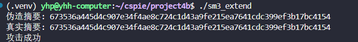

# SM3 Length-Extension Attack

本项目实现了对国密SM3散列算法的长度扩展攻击。

## 原理

SM3算法的长度扩展攻击利用了哈希函数的以下特性：
- 在已知消息M的哈希值H(M)的情况下，攻击者可以构造新消息M'，使得H(M')可以被预测。
- 无需知道原始消息M的完整内容，只需要知道其长度和哈希值。


## 使用方法

### 编译

编译c++文件：
```bash
g++ sm3_extend.cpp -o sm3_extend 
```

## 运行结果

发现伪造的和真实的结果一样，证明了SM3算法存在长度扩展攻击的安全漏洞。


