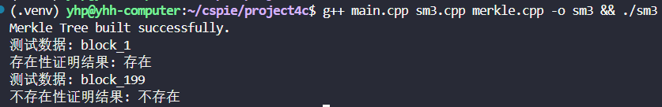

# 基于 SM3 的 Merkle Tree 实现

## 项目概述

本项目基于国密 SM3 哈希算法实现了完整的 Merkle 树数据结构，遵循 RFC6962 标准规范。支持大规模数据集（10万叶子节点）的高效存储和验证，并提供完整的存在性证明和不存在性证明功能。

## Merkle Tree 

### 基本概念

Merkle Tree是一种哈希树，他具有以下特点：

- **叶子节点**：存储原始数据的哈希值
- **非叶子节点**：存储其两个子节点哈希值的哈希
- **根节点**：整棵树的顶部节点，代表整个数据集的指纹

### 构建算法

1. **叶子层构建**：对每个原始数据计算 SM3 哈希值
2. **向上合并**：相邻两个节点的哈希值连接后再次哈希
3. **递归构建**：重复步骤2直到只剩一个根节点
4. **奇数处理**：当节点数为奇数时，最后一个节点与自己合并

#### 哈希计算

- **叶子节点哈希**：`MTH = SM3(0x00 || data)`
- **内部节点哈希**：`MTH = SM3(0x01 || left_hash || right_hash)`

### 存在性证明

#### 原理

存在性证明用于验证某个数据存在于 Merkle 树中。

#### 证明路径

```
证明 Data A 存在：
1. 提供 Hash(B) - A的兄弟节点
2. 提供 Hash(C+D) - 父节点的兄弟节点
3. 验证者计算：
   - Hash(A+B) = SM3(0x01 || Hash(A) || Hash(B))
   - Root = SM3(0x01 || Hash(A+B) || Hash(C+D))
```

## 编译

使用以下命令来编译本项目：

```bash
g++ main.cpp sm3.cpp merkle.cpp -o sm3

```

## 结果

