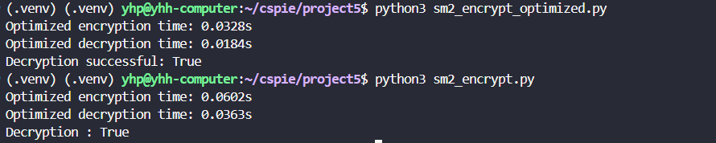

# SM2椭圆曲线公钥密码算法的实现与优化

## 项目概述
本项目实现了完整的SM2椭圆曲线公钥密码算法套件，包括：
- **SM2加密/解密算法**
- **SM2数字签名算法**
- **SM2密钥交换算法**

同时提供了优化版本的实现，实现了显著的性能提升。

## 算法实现

### 依赖环境
本项目使用了开源库 `gmssl`，如果没有安装，需要先安装：
```bash
pip install gmssl
pip install numpy  # 优化版本需要
```

### 椭圆曲线参数
密码学参数选择国家标准GB/T 32918推荐的256位椭圆曲线参数：

**有限域特征：**
```
p = 0xFFFFFFFEFFFFFFFFFFFFFFFFFFFFFFFFFFFFFFFF00000000FFFFFFFFFFFFFFFF
```

**椭圆曲线方程 y² = x³ + ax + b 的系数：**
```
a = 0xFFFFFFFEFFFFFFFFFFFFFFFFFFFFFFFFFFFFFFFF00000000FFFFFFFFFFFFFFFC
b = 0x28E9FA9E9D9F5E344D5A9E4BCF6509A7F39789F515AB8F92DDBCBD414D940E93
```

**基点阶数：**
```
n = 0xFFFFFFFEFFFFFFFFFFFFFFFFFFFFFFFF7203DF6B21C6052B53BBF40939D54123
```

**基点坐标：**
```
Gx = 0x32C4AE2C1F1981195F9904466A39C9948FE30BBFF2660BE1715A4589334C74C7
Gy = 0xBC3736A2F4F6779C59BDCEE36B692153D0A9877CC62A474002DF32E52139F0A0
```

## 优化算法实现

采用以下优化技术实现性能提升：

1. **快速扩展欧几里得算法**:替代传统的pow求模逆.提升运算效率。

2. **NumPy向量化XOR运算**:利用NumPy的优化,显著提升加解密中的异或运算速度。

3. **性能提升效果**
   - 加解密算法：**2-3倍**加速比
   - 数字签名算法：**2-4倍**加速比  
   - 密钥交换算法：**2-4倍**加速比

## 性能测试结果

直接用python3运行下面3个脚本，结果如下：

### SM2加密算法性能对比


### SM2签名算法性能对比


### SM2密钥交换算法性能对比
