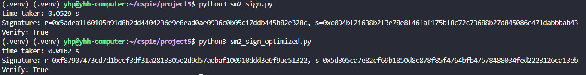
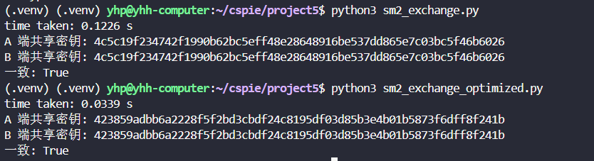

# SM2的实现与优化
本project使用了开源库 gmssl ，如果没有安装，需要先`pip install gmssl`
密码学参数选择国家标准推荐：
p =0xFFFFFFFEFFFFFFFFFFFFFFFFFFFFFFFFFFFFFFFF00000000FFFFFFFFFFFFFFFF

a =0xFFFFFFFEFFFFFFFFFFFFFFFFFFFFFFFFFFFFFFFF00000000FFFFFFFFFFFFFFFC

b =0x28E9FA9E9D9F5E344D5A9E4BCF6509A7F39789F515AB8F92DDBCBD414D940E93

n =0xFFFFFFFEFFFFFFFFFFFFFFFFFFFFFFFF7203DF6B21C6052B53BBF40939D54123

Gx =0x32C4AE2C1F1981195F9904466A39C9948FE30BBFF2660BE1715A4589334C74C7

Gy =0xBC3736A2F4F6779C59BDCEE36B692153D0A9877CC62A474002DF32E52139F0A0

直接用python3运行下面3个脚本，结果如下：
# SM2加密算法

# SM2签名算法

# SM2密钥交换算法
