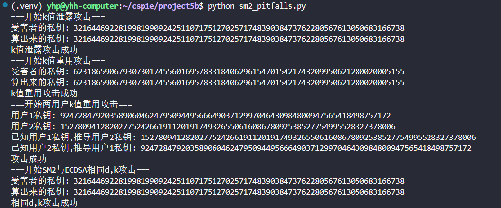

# SM2 Pitfalls 

本项目演示了SM2数字签名算法中常见的安全缺陷和攻击方法。虽然SM2数字签名算法本身是安全的。但是在应用过程中由于各种使用不当，会有多种安全风险。本project将展示这些风险。

## k值泄露攻击

### 攻击原理
当签名过程中使用的随机数k被泄露时，攻击者可以通过签名恢复私钥。

### 数学推导
SM2签名方程：`s = inv(1+key) * (k - r*key) mod n`

变换得到：`s * (1+key) = k - r*key mod n`

展开：`s + s*key = k - r*key mod n`

整理：`key * (s + r) = k - s mod n`

求解私钥：`key = (k - s) * inv(s + r) mod n`

## k值重用攻击

### 攻击原理
同一用户使用相同的k值对不同消息进行签名时，攻击者可以通过两个签名恢复私钥。

### 数学推导
两个签名方程：
- `s1 = inv(1+key) * (k - r1*key) mod n`
- `s2 = inv(1+key) * (k - r2*key) mod n`

两式相减消除k：
`(s1 - s2) * (1 + key) = (r2 - r1) * key mod n`

整理得：`key = (s1 - s2) * inv(r2 - r1 - s1 + s2) mod n`

## 两用户k值重用攻击

### 攻击原理
不同用户使用相同的k值进行签名时，已知一个用户的私钥可以推导出另一个用户的私钥。

### 数学推导
两个用户的签名方程：
- 用户1：`s1 = inv(1+d1) * (k - r1*d1) mod n`
- 用户2：`s2 = inv(1+d2) * (k - r2*d2) mod n`

由于使用相同的k，可以建立关系：
`d1*(s1 + r1) - d2*(s2 + r2) = s2 - s1 mod n`

如果已知d1，可求d2：
`d2 = (d1*(s1 + r1) - s2 + s1) * inv(s2 + r2) mod n`

## same_d_k_with_ecdsa 

### 攻击原理
在SM2和ECDSA中重用相同的私钥d和随机数k时可以反解出d。

### 数学推导
ECDSA签名：`s1 = (e1 + r1*d) * k^(-1) mod n`
- 变换：`d*r1 = k*s1 - e1 mod n`

SM2签名：`s2 = inv(1+d) * (k - r2*d) mod n`
- 变换：`d*(s2+r2) = k - s2 mod n`

两个方程构成关于d和k的线性方程组，可以求解。

## 使用方法

```bash
python sm2_pitfalls.py
```

运行后将依次演示各种攻击场景，展示SM2签名算法的潜在安全问题。

## 结果
