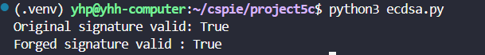

# ECDSA 数字签名伪造
## 寻找公钥
通过网络搜索发现。中本聪的公钥一直不为人所知，只知道一些公共的比特币地址，所以本次实验随机选取一个公钥进行伪造。
## Threat Model
直接对ECDSA协议进行攻击在当前算力的条件下是不可能成功的，所以我选择了验证方不检查消息，也不对消息进行哈希，只验证签名的情况实施攻击。这种操作在上一个实验里已经知道是不安全的。

## 攻击原理

### ECDSA验证算法回顾

正常的ECDSA验证过程如下：
1. 给定消息 `m`、签名 `(r,s)` 和公钥 `Q`
2. 计算消息哈希：`z = H(m) mod n`
3. 计算：`s⁻¹ mod n`
4. 计算：`u₁ = z·s⁻¹ mod n`，`u₂ = r·s⁻¹ mod n`
5. 计算点：`P = u₁·G + u₂·Q`
6. 验证：`P.x ≡ r (mod n)`

### 直接空摘要攻击方法

**核心思想**：构造签名 `(r,s)` 使得 `((r·s⁻¹)·Q).x = r`

**攻击步骤**：
1. 选择随机数 `k ∈ [1, n-1]`
2. 计算点 `P = k·Q`
3. 设置 `r = P.x mod n`
4. 计算 `s = r·k⁻¹ mod n`

**数学验证**：
```
验证时计算的点 = (r·s⁻¹)·Q
                = (r·(r·k⁻¹)⁻¹)·Q
                = (r·k·r⁻¹)·Q
                = k·Q
                = P
```

因此验证必然通过！

## 攻击结果
