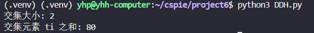

# DDH-based Private Intersection-Sum Protocol实现

## 协议简介
DDH-based Private Intersection-Sum Protocol是一个基于椭圆曲线上判定性Diffie-Hellman假设的安全多方计算协议，允许两方在不泄露各自私有集合内容的情况下计算内容。

## 依赖项安装
``` 
pip install phe
pip install ecdsa
```
## 代码实现
- 注意到在椭圆曲线群中，群运算是点加法，所以：H(vi)^k1 在椭圆曲线中实际是 k1 * H(vi)，椭圆曲线群是加法群，所以 a^b 对应 b*a
- 这里用了paillier密钥生成为p2生成密钥对。
- 使用SECP256k1椭圆曲线
- 实现了协议中的三轮通信：
  - Round 1: P1计算并发送H(vi)^k1
  - Round 2: P2计算H(vi)^k1k2和(H(wj)^k2, AEnc(tj))
  - Round 3: P1计算交集并同态求和
- 为保护隐私，在发送数据时进行了shuffling操作

## 运行方式
```bash
python3 DDH.py
```
## 结果
